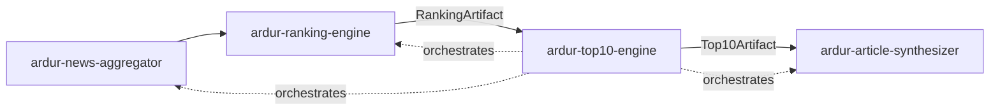
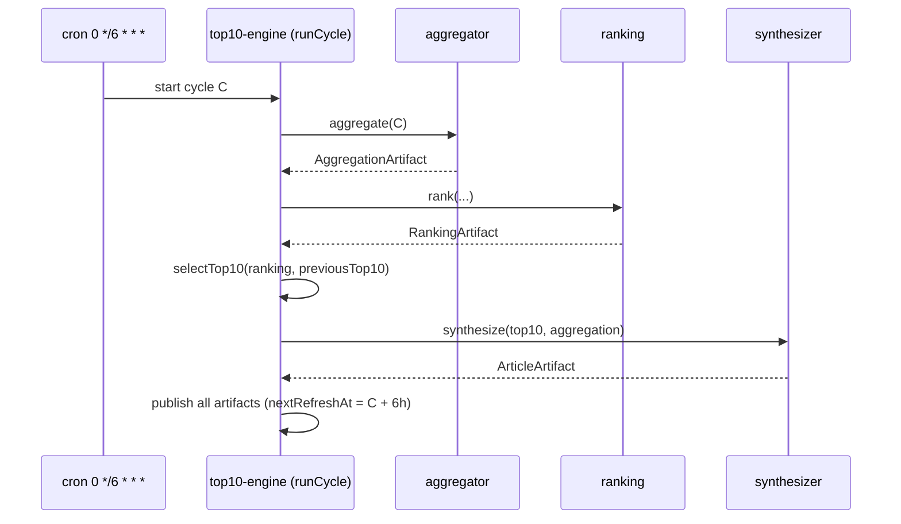

# ardur-top10-engine

> **Stage 3 of the [Ardur AI content pipeline](./ARCHITECTURE.md) — and its
> orchestrator.** Selects the Top-10 per topic from a
> [`RankingArtifact`](https://github.com/ArdurAI/ardur-ranking-engine), tracks
> stability vs the previous cycle, and drives the **6-hour refresh loop** that
> wires all four engines together. Produces a `Top10Artifact` for
> [`ardur-article-synthesizer`](https://github.com/ArdurAI/ardur-article-synthesizer).

The selection core and the 6-hour orchestration loop are **implemented and
tested** (pure, deterministic, zero paid-API dependency). The orchestration's
runner wiring to the sibling engines lands as each engine ships. See
[`docs/spec.md`](./docs/spec.md), [`ARCHITECTURE.md`](./ARCHITECTURE.md), and the
design rationale in [`docs/research-notes.md`](./docs/research-notes.md).

## What it does

Two responsibilities:

1. **Top-10 selection** — from the ranked clusters, pick the ten strongest per
   topic and the global Top-10, attach copyright-safe references, and compute
   rank deltas + carry-over vs the previous cycle (anti-churn hysteresis keeps
   the list from thrashing every 6 hours).
2. **Orchestration** — own the **6-hour cycle**: `aggregate → rank → select →
   synthesize → publish`. Cycles are UTC-aligned (00:00 / 06:00 / 12:00 / 18:00),
   each stage idempotent per `cycle.id`, with last-good-wins on failure.

## Pipeline position



## The 6-hour loop



The other three stages are injected as `StageRunners`, so this engine stays
independently developable and testable — it depends on artifacts, not internals.

## Output contract

`selectTop10(ranking, previous)` returns a `Top10Artifact` (see
[`src/contracts.ts`](./src/contracts.ts)):

- `top10ByTopic` / `global` — `Top10Entry[]` (rank 1..10) with `score`,
  `sourceQuality`, `confidence`, deduped copyright-safe `references`, `delta`
  (`new`/`up`/`down`/`same`), and `carriedOver`.
- `stability` — `{ carriedOver, fresh, churnRate }` vs the previous cycle.
- `nextRefreshAt` — `cycle.windowEnd` (start + 6h).

## Project layout

| Path | Role |
|------|------|
| `src/contracts.ts` | Shared pipeline contract (identical across all 4 repos). |
| `src/index.ts` | Public exports. |
| `src/cycle.ts` | 6-hour cycle math (UTC-aligned windows). |
| `src/select.ts` | Top-10 selection — tie-breaking + category balancing. |
| `src/references.ts` | Copyright-safe `referencesFor()` (dedup + cap). |
| `src/url.ts` | URL normalization + public/PII safety screen. |
| `src/stability.ts` | Cross-cycle deltas + stability/churn + hysteresis. |
| `src/orchestrate.ts` | `runCycle()` — the full pipeline conductor. |
| `src/cli.ts` | Select Top-10 from a ranking artifact. |
| `docs/research-notes.md` | Best-practice research behind the orchestration. |
| `.github/workflows/refresh.yml` | 6-hour scheduled cycle (reference trigger). |

## Grounding in the existing system

Extracts and re-times work on
[`ardur.ai`](https://github.com/ArdurAI/ardur.ai) `main`:

- The top-N slice + reference assembly in `scripts/build-news-digests.mjs` →
  `select.ts`.
- The scheduled refresh in `.github/workflows/hourly-intelligence.yml` →
  `refresh.yml`, moved from **hourly to every 6 hours** and generalized to drive
  the four-engine pipeline.
- Adds **stability/deltas** (new) so the Top-10 is steady across cycles.

## Usage

### Library

```ts
import { selectTop10, runCycle, cycleFor } from '@ardurai/top10-engine';

// Pure selection: RankingArtifact (+ previous Top-10, + aggregation for refs).
const top10 = selectTop10(rankingArtifact, previousTop10, {
  size: 10,
  stabilityMargin: 0.5, // anti-churn hysteresis (default 0)
  aggregation, // needed to build copyright-safe references
});

// One orchestrated 6-hour cycle (stages injected as StageRunners).
const result = await runCycle(runners, { now: new Date() });
// result.status: 'published' | 'degraded' | 'failed'
```

### CLI

```bash
# ranking.json -> top10.json. previous + aggregation are optional;
# pass "-" to skip previous. Aggregation is required for references.
node --experimental-strip-types src/cli.ts ranking.json - aggregation.json > top10.json
```

> **References need the aggregation artifact.** A `RankedCluster` carries only
> `memberIds`, so the per-source metadata for copyright-safe `references` is
> resolved from the same cycle's `AggregationArtifact`, threaded via
> `SelectionOptions.aggregation` (this does **not** change the shared
> `contracts.ts`). Without it the Top-10 is still produced, with empty
> `references[]` and a warning. Tracked upstream as a contract data-flow note.

## Getting started

```bash
npm install
npm run format:check   # prettier
npm run lint           # eslint
npm run typecheck      # tsc --noEmit (strict)
npm test               # node --test, deterministic
npm run build          # tsc -> dist (tests/fixtures excluded)
```

## Guarantees

- **Idempotent per cycle** — re-running a `cycle.id` reproduces the artifact.
- **Last-good-wins** — a failed cycle never blanks the app; the prior cycle stays live.
- **Copyright-safe references** — capped, deduped, attribution + canonical links only.
- **Independently developable** — sibling engines injected via `StageRunners`.

## License

MIT © 2026 ArdurAI
