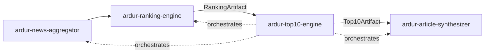
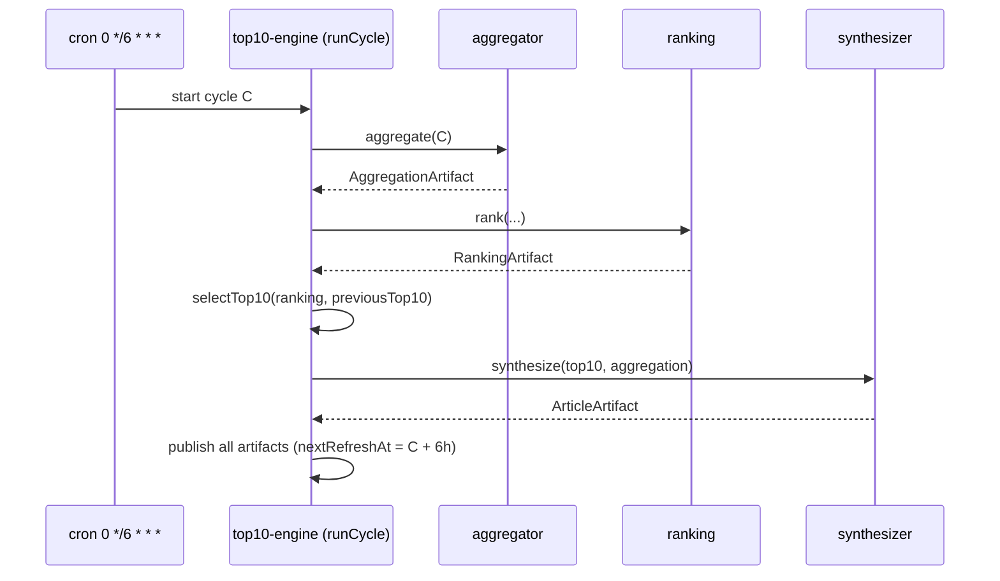

# ardur-top10-engine

> **Stage 3 of the [Ardur AI content pipeline](./ARCHITECTURE.md) — and its
> orchestrator.** Selects the Top-10 per topic from a
> [`RankingArtifact`](https://github.com/ArdurAI/ardur-ranking-engine), tracks
> stability vs the previous cycle, and drives the **6-hour refresh loop** that
> wires all four engines together. Produces a `Top10Artifact` for
> [`ardur-article-synthesizer`](https://github.com/ArdurAI/ardur-article-synthesizer).

This repository is a **design specification + minimal scaffold**. Interfaces and
wiring are final; engine logic is intentionally unimplemented (every module
throws `not implemented`). See [`docs/spec.md`](./docs/spec.md) and
[`ARCHITECTURE.md`](./ARCHITECTURE.md).

## What it does

Two responsibilities:

1. **Top-10 selection** — from the ranked clusters, pick the ten strongest per
   topic and the global Top-10, attach copyright-safe references, and compute
   rank deltas + carry-over vs the previous cycle (anti-churn hysteresis keeps
   the list from thrashing every 6 hours).
2. **Orchestration** — own the **6-hour cycle**: `aggregate → rank → select →
   synthesize → publish`. Cycles are UTC-aligned (00:00 / 06:00 / 12:00 / 18:00),
   each stage idempotent per `cycle.id`, with last-good-wins on failure.

## Pipeline position



## The 6-hour loop



The other three stages are injected as `StageRunners`, so this engine stays
independently developable and testable — it depends on artifacts, not internals.

## Output contract

`selectTop10(ranking, previous)` returns a `Top10Artifact` (see
[`src/contracts.ts`](./src/contracts.ts)):

- `top10ByTopic` / `global` — `Top10Entry[]` (rank 1..10) with `score`,
  `sourceQuality`, `confidence`, deduped copyright-safe `references`, `delta`
  (`new`/`up`/`down`/`same`), and `carriedOver`.
- `stability` — `{ carriedOver, fresh, churnRate }` vs the previous cycle.
- `nextRefreshAt` — `cycle.windowEnd` (start + 6h).

## Project layout

| Path | Role |
|------|------|
| `src/contracts.ts` | Shared pipeline contract (identical across all 4 repos). |
| `src/index.ts` | Public exports. |
| `src/cycle.ts` | 6-hour cycle math (UTC-aligned windows). |
| `src/select.ts` | Top-10 selection + references + deltas + stability. |
| `src/orchestrate.ts` | `runCycle()` — the full pipeline conductor. |
| `src/cli.ts` | Select Top-10 from a ranking artifact. |
| `.github/workflows/refresh.yml` | 6-hour scheduled cycle (scaffold). |

## Grounding in the existing system

Extracts and re-times work on
[`ardur.ai`](https://github.com/ArdurAI/ardur.ai) `main`:

- The top-N slice + reference assembly in `scripts/build-news-digests.mjs` →
  `select.ts`.
- The scheduled refresh in `.github/workflows/hourly-intelligence.yml` →
  `refresh.yml`, moved from **hourly to every 6 hours** and generalized to drive
  the four-engine pipeline.
- Adds **stability/deltas** (new) so the Top-10 is steady across cycles.

## Getting started

```bash
npm install
npm run typecheck
npm test
npm run build
```

## Guarantees

- **Idempotent per cycle** — re-running a `cycle.id` reproduces the artifact.
- **Last-good-wins** — a failed cycle never blanks the app; the prior cycle stays live.
- **Copyright-safe references** — capped, deduped, attribution + canonical links only.
- **Independently developable** — sibling engines injected via `StageRunners`.

## License

MIT © 2026 ArdurAI
