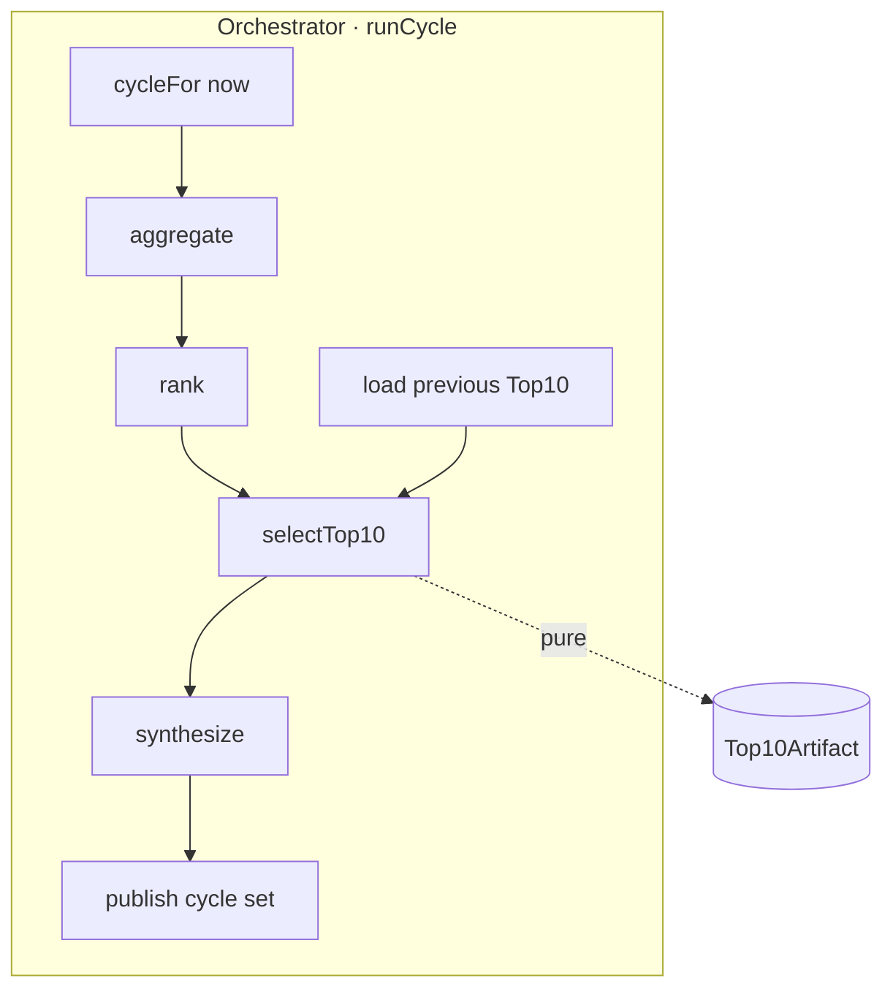
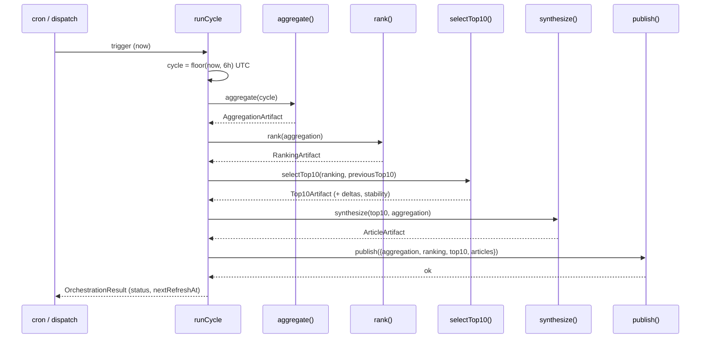

# ardur-top10-engine — Design Specification

Schema version: `ardur-content-pipeline/v1` · Stage 3 of 4 (+ orchestrator) · Status: **spec + scaffold**

---

## 1. Architecture overview

Two concerns in one engine:

1. **Selection** (`select.ts`) — a pure function
   `Top10Artifact = select(RankingArtifact, previousTop10)`. No I/O.
2. **Orchestration** (`orchestrate.ts`) — `runCycle(runners)` drives a full
   6-hour pipeline pass, calling the other three engines through injected
   `StageRunners` (lib import or CLI). The top10-engine is the **only** engine
   that knows the whole pipeline; the other three are independent leaf functions.

## 2. Data flow

## 3. Data schemas

Authoritative types in the `@ardurai/contracts` package (adopted; not vendored locally).

### `Top10Entry`
`rank` (1..10), `clusterId`, `topic`/`topicLabel`, `headline`, `score`
(`ScoreBreakdown`), `sourceQuality`, `confidence`, `references` (`SourceRef[]`,
deduped/capped), `delta` (`{ previousRank, movement }`), `carriedOver`.

### `Top10Data`
`nextRefreshAt`, `topicsCovered`, `top10ByTopic`, `global`, `stability`
(`{ carriedOver, fresh, churnRate }`).

### `SourceRef` (copyright-safe)
`source`, `sourceDomain`, `tier`, `url`, `title`, `publishedAt` — link +
attribution metadata only; never article body.

## 4. Top-10 rules / calculations

- **Per topic**: take the top `size` (default 10) `RankedCluster`s by
  `score.total`. The global Top-10 is selected over the `all` topic / the union,
  de-duplicated by `clusterId`.
- **References**: from each cluster's members, keep up to `maxReferences`
  (default 5) distinct `(source, title)` pairs, normalized to safe public URLs.
  Rev-3 ranking artifacts carry pre-built references; the data layer forwards the
  full set and delegates display capping to the renderer.
- **Deltas**: compare each entry's `clusterId` to the previous cycle's Top-10 →
  `movement ∈ {new, up, down, same}` and `carriedOver`.
- **Stability / anti-churn**: optional `stabilityMargin` hysteresis retains an
  incumbent when a challenger only marginally outscores it, so the list does not
  thrash every 6 hours. `churnRate` = fraction of slots replaced vs previous cycle.
- **Tie-breaking**: total score, then higher `confidence` (high > medium > low),
  then `corroboration`, then more recent `latestPublishedAt`, then `distinctDomains`,
  then stable `clusterId` (lexicographic).

## 5. The 6-hour refresh orchestration

- **Window**: `floor(now, 6h)` UTC. `cycle.id` = ISO window start; windows at
  00:00 / 06:00 / 12:00 / 18:00. `nextRefreshAt = windowEnd`.
- **Idempotency**: every stage is keyed on `cycle.id`; re-running a cycle
  overwrites in place. Safe to retry a partially failed cycle.
- **Failure policy (last-good-wins)**: if any stage fails, `runCycle` returns
  `status: 'failed' | 'degraded'` and does **not** publish a partial set; the
  app keeps serving the previous cycle's artifacts. No blank states.
- **Scheduling**: `.github/workflows/refresh.yml` (`cron: 0 */6 * * *`) is the
  reference trigger, ported from `hourly-intelligence.yml` and re-timed.
- **runId chain**: each stage's `runId` is recorded as the next stage's
  `upstreamRunId`, so a published cycle is fully traceable end to end.

## 6. Error handling, monitoring, fallback

- **Injected runners**: stage failures surface as thrown errors caught by
  `runCycle`, collected into `warnings`, and classified into the result status.
- **Degraded vs failed**: `degraded` = published but with upstream coverage
  warnings; `failed` = nothing published this cycle.
- **Monitoring**: `churnRate`, `stability.fresh`, per-topic fill (did every topic
  reach 10?), cycle wall-time vs the 25-min SLO, and `status`. Alert on
  `failed`, on churn spikes, and on under-filled topics.

## 7. Performance / scalability / latency

- **Selection p95 ≤ 30 s** — in-memory over ranked clusters.
- **Full cycle p95 ≤ 25 min** (aggregation dominates) — see ARCHITECTURE §8.
  That leaves > 5h33m of slack inside each 6h window for retries.
- Orchestration is single-flight (`concurrency` guard) so cycles never overlap.

## 8. Security + data provenance

- References are built copyright-safe (no bodies) and PII-free (normalized URLs).
- The published cycle set carries the full `runId`/`upstreamRunId` chain plus the
  ranking audit trail — end-to-end provenance from source feed to Top-10 slot.
- Orchestration secrets (provider keys) live only in the scheduled environment,
  never in artifacts or logs.

## 9. Migration from `ardur.ai/main`

1. **Extract the top-N slice + reference assembly** from
   `build-news-digests.mjs` into `select.ts`.
2. **Re-time `hourly-intelligence.yml`** to `0 */6 * * *` as `refresh.yml`, and
   change it from "run the monolith refresh" to "run `runCycle` across the four
   engines."
3. **Add deltas/stability** — new; the monolith recomputed the list fresh each
   hour with no carry-over.
4. During migration, `runCycle` can shell out to the existing monolith scripts as
   stage runners, then swap them for the standalone engines one at a time.

## 10. Open questions (tracked as issues)

- Default `stabilityMargin` value (how sticky should incumbents be?).
- Global Top-10 over the `all` topic vs a cross-topic merge with per-topic caps.
- Whether to persist N previous cycles for trend/sparkline UI.
